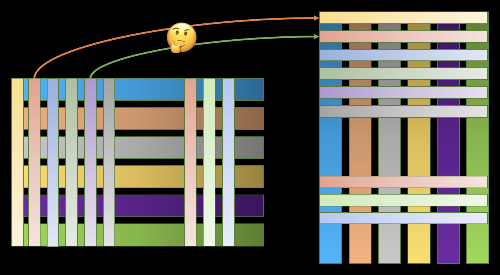

# Bad Transformer

Bad Transformer is a simpled and easy-understand transfomer proposed by ```Shizhuo Zhang (SuperHacker UEFI)```, and may have same effects as the orignal transformer.

What's more, it generate semantic hybrid tensor and then maping to the space of prediction token embedding.



## Using Sence

Image Resolution Upscaling: [Xresolution](https://github.com/UEFI-code/Xresolution), a 18KB model!

Image Classfication

Image Generation

Large Language Model [pyllama_Hack](https://github.com/UEFI-code/pyllama_Hack)

...