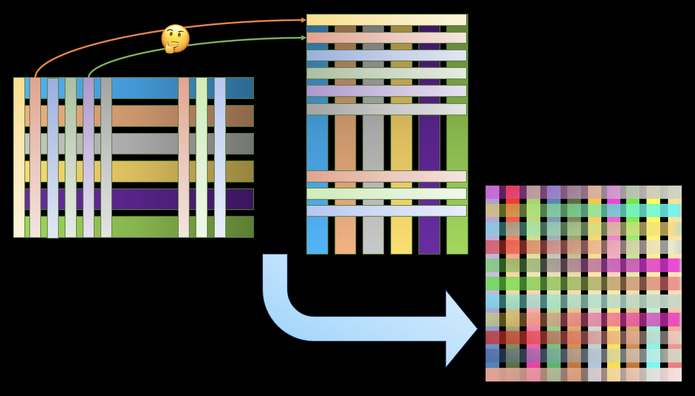

# Bad Transformer

Bad Transformer is a simpled and easy-understand transfomer proposed by ```Shizhuo Zhang (SuperHacker UEFI)```, and may have same effects as the orignal transformer.



## Using Sence

Image Resolution Upscaling: [Xresolution](https://github.com/UEFI-code/Xresolution), a 18KB model!

Image Classfication

Image Generation

NLP

...